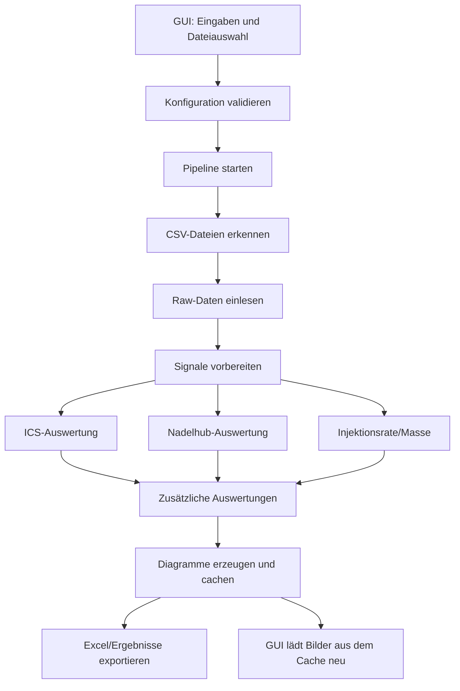

# Architektur für das Main-Skript und die Unterfunktionen

## Status
Die Architektur passt im aktuellen Stand grundsätzlich gut. Die Trennung in GUI, Pipeline, Vorverarbeitung, Analyse, Plotting und Export ist bereits umgesetzt.

Wesentliche Präzisierungen gegenüber der älteren Skizze:
- [ITAZ_Inj_Eval_208.py](ITAZ_Inj_Eval_208.py) ist heute nur noch ein dünner Wrapper.
- Der eigentliche Orchestrator ist [pipeline.py](pipeline.py).
- Die GUI übernimmt neben der Bedienung auch Dateiauswahl, `shot_log.csv`-Einlesung, Sensor-Auswahl und das Nachladen der Bilder aus dem In-Memory-Cache.

## Ziel
Die Analyse soll aus klar getrennten Bausteinen bestehen. Dadurch bleibt der Ablauf testbar, erweiterbar und nachvollziehbar.

## Grundidee
Der Analyseablauf ist in folgende Bereiche aufgeteilt:

1. Konfiguration laden und validieren
2. Dateien einlesen
3. Rohdaten vorbereiten
4. Signale erzeugen und interpolieren
5. Auswertungen durchführen
6. Grafiken erzeugen und cachen
7. Ergebnisse exportieren

---

## Vorschlag für die Modulstruktur

```text
project/
├── ITAZ_Inj_Eval_GUI_github.py     # GUI-Einstiegspunkt
├── ITAZ_Inj_Eval_208.py            # Kompatibilitäts-Wrapper für die Pipeline
├── pipeline.py                     # Haupt-Orchestrator / Pipeline
├── config.py                       # Konfigurationsmodell und Defaults
├── io_utils.py                     # Datei- und CSV-Import
├── preprocessing.py                # Rohdaten -> Signale
├── analysis/
│   ├── ics.py                      # Plateau-/ICS-Auswertung
│   ├── needle_lift.py              # Nadelhub-Analyse
│   ├── injection_rate.py           # Injektionsrate und Masse
│   ├── gain.py                     # Gain-Kurve
│   ├── rate_down.py                # Rate-Down-Auswertung
│   └── shot2shot.py                # Shot-to-Shot-Statistik
├── plotting.py                     # Diagramme und Bild-Ausgabe
├── export.py                       # Excel- und Ergebnis-Export
├── image_cache_manager.py          # Globaler In-Memory-Bildcache
├── image_utils.py                  # Persistenz/Cache-Helfer für Figuren
└── Fkt/                            # Bestehende Spezialfunktionen und Legacy-Utilities
```

---

## Verantwortlichkeiten der Module

### 1. GUI-Einstiegspunkt
Datei: [ITAZ_Inj_Eval_GUI_github.py](ITAZ_Inj_Eval_GUI_github.py)

Aufgabe:
- Nutzer-Interaktion
- Eingaben sammeln
- Konfiguration an die Analyse übergeben
- `shot_log.csv` einlesen und tabellarisch darstellen
- Ergebnisse und Bilder aus dem Cache anzeigen

### 2. Haupt-Orchestrator
Datei: [pipeline.py](pipeline.py)

Aufgabe:
- Ablauf steuern
- Daten von einem Schritt zum nächsten weitergeben
- Cache vor jedem Lauf leeren
- Eingabedateien finden, Messdaten laden und Vorverarbeitung starten
- Analyse, Plotting und Export koordinieren
- nur die Orchestrierung enthalten, keine fachliche Detailrechnung

### 2a. Wrapper für Abwärtskompatibilität
Datei: [ITAZ_Inj_Eval_208.py](ITAZ_Inj_Eval_208.py)

Aufgabe:
- `run_main_analysis(cfg)` bereitstellen
- auf [pipeline.py](pipeline.py) weiterleiten

### 3. Konfigurationsmodul
Datei: [config.py](config.py)

Aufgabe:
- Standardwerte definieren
- GUI-Werte validieren
- Sensorfaktoren und Auswerteparameter bündeln

Beispiel:
- gas parameters
- A, Temp, step_size
- boost/hold/zero ranges
- Flags für Gain, RateDown, Shot2Shot

### 4. Datei- und Datenimport
Datei: [io_utils.py](io_utils.py)

Aufgabe:
- CSV-Dateien auslesen
- `shot_log.csv` verarbeiten
- Dateinamen erkennen und in eine einheitliche Struktur bringen

### 5. Vorverarbeitung
Datei: [preprocessing.py](preprocessing.py)

Aufgabe:
- Rohsignale in Standard-Signale umwandeln
- Nadelhub, Systemdruck, Injektionsrate, Steuersignal, Leistung und Energie erzeugen
- Zeitbasis erzeugen und interpolieren

### 6. Auswertungsmodule
Ordner: [analysis](analysis)

Jedes Modul hat eine klare Aufgabe:
- [ics.py](analysis/ics.py): Plateau- und ICS-Auswertung
- [needle_lift.py](analysis/needle_lift.py): Nadelhub-Integral und Hubzeiten
- [injection_rate.py](analysis/injection_rate.py): Injektionsrate und Masse
- [gain.py](analysis/gain.py): Gain-Kurve
- [rate_down.py](analysis/rate_down.py): Rate-Down-Auswertung
- [shot2shot.py](analysis/shot2shot.py): Statistik über Shots

### 7. Plotting
Datei: [plotting.py](plotting.py)

Aufgabe:
- Diagramme erzeugen
- Ergebnisbilder in den Cache schreiben und optional auf Disk persistieren
- bestehende Funktionen aus [Fkt/Fig01.py](Fkt/Fig01.py), [Fkt/FigDict02.py](Fkt/FigDict02.py) und [Fkt/Intpol02.py](Fkt/Intpol02.py) einbinden
- Signalplots pro Datei für die GUI vorbereiten

### 8. Export
Datei: [export.py](export.py)

Aufgabe:
- Excel-Dateien erzeugen
- Ergebnis-Tabellen zusammenstellen
- Common-Parameter und Shot-Log exportieren
- optionale Zusatztabellen für Gain, Rate-Down und Shot2Shot schreiben

### 9. Bildcache
Datei: [image_cache_manager.py](image_cache_manager.py)

Aufgabe:
- Bilder zentral im Speicher halten
- pro Analyse-Lauf vorab leeren
- von Plotting und GUI gemeinsam nutzen

---

## Schnittstellenübersicht

Die folgende Übersicht zeigt die wichtigsten Ein- und Ausgangsgrößen zwischen den Modulen. Sie ist bewusst auf die fachlich relevanten Daten reduziert.

| Modul | Eingang | Ausgang |
| --- | --- | --- |
| [ITAZ_Inj_Eval_GUI_github.py](ITAZ_Inj_Eval_GUI_github.py) | Benutzereingaben, Dateiauswahl, Sensorwahl, optional `shot_log.csv` | Konfigurations-`dict` für die Pipeline, geladene Shot-Log-Daten, UI-Status |
| [ITAZ_Inj_Eval_208.py](ITAZ_Inj_Eval_208.py) | Konfigurations-`dict` | Weiterleitung an [pipeline.py](pipeline.py) |
| [pipeline.py](pipeline.py) | Konfigurations-Objekt, ausgewählte CSV-Dateien | `signal_dict`, Zeitbasis `T`, Analyseergebnisse, Export, Cache-Befüllung |
| [io_utils.py](io_utils.py) | Dateipfade, Messdateien, `shot_log.csv` | Rohdaten je Datei, Shot-Log-Struktur |
| [preprocessing.py](preprocessing.py) | Rohdaten, Konfiguration, Sensorfaktoren | Interpolierte Standard-Signale wie Nadelhub, Druck, Rate, Steuersignal, Leistung, Energie |
| [analysis/ics.py](analysis/ics.py) | Signal-Daten, ICS-Bereiche, Zeitachse | ICS-/Plateau-Ergebnis, Kennwerte, relevante Zeitfenster |
| [analysis/needle_lift.py](analysis/needle_lift.py) | Signal-Daten, Zeitachse | Integrierter Nadelhub, Hubzeiten |
| [analysis/injection_rate.py](analysis/injection_rate.py) | Signal-Daten, Gasparameter, Nadelhub-Zeiten | Injektionsrate, kumulierte Masse |
| [analysis/gain.py](analysis/gain.py) | Signal-Daten, ICS-Ergebnis, Hubzeiten, Schrittweite | Gain-Kurven-Ergebnis, aggregierte Werte |
| [analysis/rate_down.py](analysis/rate_down.py) | Signal-Daten, Hubzeiten, Schrittweite | Rate-Down-Ergebnis, aggregierte Werte |
| [analysis/shot2shot.py](analysis/shot2shot.py) | Signal-Daten, ICS-Ergebnis, Hubzeiten, Schrittweite | Shot2Shot-Statistiken |
| [plotting.py](plotting.py) | Signal-Daten, Zeitachse, Rohdaten optional | Diagrammdateien, Cache-Einträge für GUI |
| [export.py](export.py) | Signal-Daten, Konfiguration, Analyseergebnisse, Shot-Log | Excel-Datei mit Signal-, Common- und Statistikblättern |
| [image_cache_manager.py](image_cache_manager.py) | Vom Plotting erzeugte Figuren | In-Memory-Bildcache für die GUI |

---

## Datenfluss der Pipeline



---

## Vorschlag für die Hauptfunktion

```python
def run_analysis_pipeline(cfg):
    config = validate_config(cfg)
    file_infos = discover_input_files(config.selected_files)
    raw_data = load_measurement_files(file_infos)
    signal_data, t_common = build_signal_dict(raw_data, config)

    ics_result = analyze_plateaus(signal_data, config)
    lift_result = analyze_and_plot_needle_lifts(signal_data, t_common)
    rate_result = InjectionRate(config.cv, config.cp, config.R, config.Temp, signal_data, t_common, config.A, lift_result)

    if config.eval_gain:
        gain_result = GainCurve(signal_data, t_common, config.step_size, ics_result, lift_result)

    if config.eval_rate_dn:
        rate_down_result = RateDownCurve(signal_data, t_common, config.step_size, lift_result)

    if config.shot2shot:
        shot2shot_result = Eval_Shot2Shot(signal_data, t_common, config.step_size, ics_result, lift_result)

    create_plots(signal_data, t_common, result_folder)
    export_results(signal_data, config, ics_result, lift_result, result_folder, ordnername)
```

---

## Zuordnung zu bestehenden Dateien im Projekt

Die vorhandenen Funktionen aus dem Ordner [Fkt](Fkt) passen sehr gut zu dieser Architektur:

- [Fkt/ICS_Eval05.py](Fkt/ICS_Eval05.py) → analysis/ics.py
- [Fkt/InjLift05.py](Fkt/InjLift05.py) → analysis/needle_lift.py
- [Fkt/InjRate03.py](Fkt/InjRate03.py) → analysis/injection_rate.py
- [Fkt/GainFig05.py](Fkt/GainFig05.py) → analysis/gain.py
- [Fkt/RateDownCurve02.py](Fkt/RateDownCurve02.py) → analysis/rate_down.py
- [Fkt/Shot2Shot02.py](Fkt/Shot2Shot02.py) → analysis/shot2shot.py
- [Fkt/Fig01.py](Fkt/Fig01.py), [Fkt/FigDict02.py](Fkt/FigDict02.py), [Fkt/Intpol02.py](Fkt/Intpol02.py) → plotting-nahe Hilfsfunktionen

---

## Kurze Bewertung
Die Architektur ist in der Praxis stimmig. Es gibt keinen akuten Umbruchbedarf.

Was aktuell noch etwas breiter ist als ideal:
- [ITAZ_Inj_Eval_GUI_github.py](ITAZ_Inj_Eval_GUI_github.py) enthält neben UI auch Datei- und `shot_log.csv`-Logik.
- [pipeline.py](pipeline.py) greift noch direkt auf mehrere Analyse- und Plot-Funktionen zu, ist aber bereits klar als Koordinationsschicht erkennbar.
- Der Bildcache ist funktional sauber, sollte aber als bewusstes Infrastruktur-Modul dokumentiert bleiben, weil GUI und Plotting davon gemeinsam abhängen.

---

## Empfehlung für den nächsten Schritt
Die sauberste Umstellung wäre:

1. [pipeline.py](pipeline.py) als einzige fachliche Orchestrierung beibehalten
2. die GUI schrittweise um Datei- und Shot-Log-Parsing entlasten, falls die Wartbarkeit weiter steigen soll
3. die bestehenden Funktionen aus [Fkt](Fkt) nur dort migrieren, wo neue Änderungen ohnehin anfallen

Damit bleibt das Projekt wartbar und du kannst später neue Auswertungen ohne großen Umbau ergänzen.