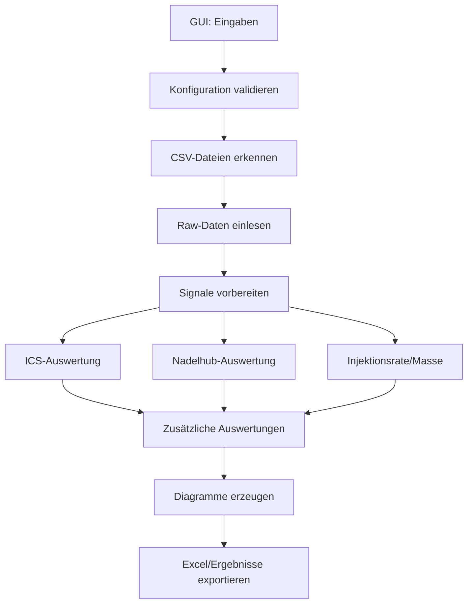

# Architektur für das Main-Skript und die Unterfunktionen

## Ziel
Die Analyse soll aus einem Haupt-"Orchestrator" bestehen, der die einzelnen Arbeitsschritte sauber trennt. Dadurch bleibt das Hauptskript übersichtlich und die Funktionen sind leichter testbar, erweiterbar und wiederverwendbar.

## Grundidee
Das aktuelle Hauptskript in [ITAZ_Inj_Eval_208.py](ITAZ_Inj_Eval_208.py) übernimmt heute zu viele Aufgaben in einer Funktion. Die Architektur sollte deshalb in folgende Bereiche aufgeteilt werden:

1. Konfiguration laden und validieren
2. Dateien einlesen
3. Rohdaten vorbereiten
4. Signale erzeugen und interpolieren
5. Auswertungen durchführen
6. Grafiken erzeugen
7. Ergebnisse exportieren

---

## Vorschlag für die Modulstruktur

```text
project/
├── ITAZ_Inj_Eval_GUI_github.py     # GUI-Einstiegspunkt
├── ITAZ_Inj_Eval_208.py            # Haupt-Orchestrator / Pipeline
├── config.py                       # Konfigurationsmodell und Defaults
├── io_utils.py                     # Datei- und CSV-Import
├── preprocessing.py                # Rohdaten -> Signale
├── analysis/
│   ├── ics.py                      # Plateau-/ICS-Auswertung
│   ├── needle_lift.py              # Nadelhub-Analyse
│   ├── injection_rate.py           # Injektionsrate und Masse
│   ├── gain.py                     # Gain-Kurve
│   ├── rate_down.py                # Rate-Down-Auswertung
│   └── shot2shot.py                # Shot-to-Shot-Statistik
├── plotting.py                     # Diagramme und Bild-Ausgabe
├── export.py                       # Excel- und Ergebnis-Export
└── Fkt/                            # Bestehende Spezialfunktionen
```

---

## Verantwortlichkeiten der Module

### 1. GUI-Einstiegspunkt
Datei: [ITAZ_Inj_Eval_GUI_github.py](ITAZ_Inj_Eval_GUI_github.py)

Aufgabe:
- Nutzer-Interaktion
- Eingaben sammeln
- Konfiguration an die Analyse übergeben
- Ergebnisse und Bilder anzeigen

### 2. Haupt-Orchestrator
Datei: [ITAZ_Inj_Eval_208.py](ITAZ_Inj_Eval_208.py)

Aufgabe:
- Ablauf steuern
- Daten von einem Schritt zum nächsten weitergeben
- keine komplexe Logik enthalten, nur Zusammenspiel der Module

### 3. Konfigurationsmodul
Datei: config.py

Aufgabe:
- Standardwerte definieren
- GUI-Werte validieren
- Sensorfaktoren und Auswerteparameter bündeln

Beispiel:
- gas parameters
- A, Temp, step_size
- boost/hold/zero ranges
- Flags für Gain, RateDown, Shot2Shot

### 4. Datei- und Datenimport
Datei: io_utils.py

Aufgabe:
- CSV-Dateien auslesen
- shot_log.csv verarbeiten
- Dateinamen erkennen und in eine einheitliche Struktur bringen

### 5. Vorverarbeitung
Datei: preprocessing.py

Aufgabe:
- Rohsignale in Standard-Signale umwandeln
- Nadelhub, Systemdruck, Injektionsrate, Steuersignal, Leistung und Energie erzeugen
- Zeitbasis erzeugen und interpolieren

### 6. Auswertungsmodule
Ordner: analysis/

Jedes Modul hat eine klare Aufgabe:
- ics.py: Plateau- und ICS-Auswertung
- needle_lift.py: Nadelhub-Integral und Hubzeiten
- injection_rate.py: Injektionsrate und Masse
- gain.py: Gain-Kurve
- rate_down.py: Rate-Down-Auswertung
- shot2shot.py: Statistik über Shots

### 7. Plotting
Datei: plotting.py

Aufgabe:
- Diagramme erzeugen
- Ergebnisbilder in Ordner schreiben
- bestehende Funktionen aus [Fkt/Fig01.py](Fkt/Fig01.py), [Fkt/FigDict02.py](Fkt/FigDict02.py) und [Fkt/Intpol02.py](Fkt/Intpol02.py) einbinden

### 8. Export
Datei: export.py

Aufgabe:
- Excel-Dateien erzeugen
- Ergebnis-Tabellen zusammenstellen
- Common-Parameter und Shot-Log exportieren

---

## Datenfluss der Pipeline



---

## Vorschlag für die Hauptfunktion

```python
def run_analysis_pipeline(cfg):
    config = validate_config(cfg)
    file_infos = discover_input_files(config.selected_files)
    raw_data = load_measurement_files(file_infos)
    signal_data = build_signal_dict(raw_data, config)

    ics_result = analyze_ics(signal_data, config)
    lift_result = analyze_needle_lift(signal_data, config)
    rate_result = analyze_injection_rate(signal_data, lift_result, config)

    if config.eval_gain:
        gain_result = analyze_gain_curve(signal_data, rate_result, ics_result, config)

    if config.eval_rate_dn:
        rate_down_result = analyze_rate_down(signal_data, rate_result, config)

    if config.eval_shot2shot:
        shot2shot_result = analyze_shot2shot(signal_data, ics_result, config)

    create_plots(signal_data, config)
    export_results(signal_data, config, ics_result, lift_result, rate_result)
```

---

## Zuordnung zu bestehenden Dateien im Projekt

Die vorhandenen Funktionen aus dem Ordner [Fkt](Fkt) passen sehr gut zu dieser Architektur:

- [Fkt/ICS_Eval05.py](Fkt/ICS_Eval05.py) → analysis/ics.py
- [Fkt/InjLift05.py](Fkt/InjLift05.py) → analysis/needle_lift.py
- [Fkt/InjRate03.py](Fkt/InjRate03.py) → analysis/injection_rate.py
- [Fkt/GainFig05.py](Fkt/GainFig05.py) → analysis/gain.py
- [Fkt/RateDownCurve02.py](Fkt/RateDownCurve02.py) → analysis/rate_down.py
- [Fkt/Shot2Shot02.py](Fkt/Shot2Shot02.py) → analysis/shot2shot.py
- [Fkt/Fig01.py](Fkt/Fig01.py), [Fkt/FigDict02.py](Fkt/FigDict02.py), [Fkt/Intpol02.py](Fkt/Intpol02.py) → plotting/export-ähnlichen Schichten

---

## Empfehlung für den nächsten Schritt
Die sauberste Umstellung wäre:

1. [ITAZ_Inj_Eval_208.py](ITAZ_Inj_Eval_208.py) nur noch als Orchestrator lassen
2. die bestehenden Funktionen aus [Fkt](Fkt) in klar getrennte Module verschieben
3. die GUI in [ITAZ_Inj_Eval_GUI_github.py](ITAZ_Inj_Eval_GUI_github.py) nur noch Konfiguration und Ergebnisdarstellung übernehmen lassen

Damit bleibt das Projekt wartbar und du kannst später neue Auswertungen ohne großen Umbau ergänzen.
