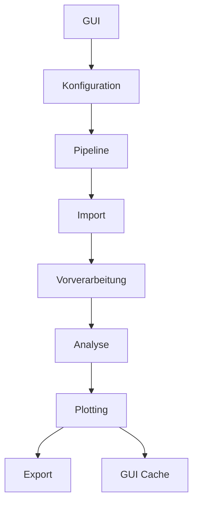

# ITAZ Injection Evaluation Tool

Python-Tool zur Auswertung von Injektordaten mit GUI, Vorverarbeitung, Analyse, Plotting und Excel-Export.

## Was das Tool macht

- CSV-Messdaten einlesen
- Signale vereinheitlichen und interpolieren
- ICS-, Nadelhub-, Injektionsrate-, Gain-, Rate-Down- und Shot2Shot-Auswertungen durchführen
- Diagramme erzeugen und in der GUI anzeigen
- Ergebnisse als Excel-Datei exportieren

## Projektstruktur

```text
ITAZ_Inj_Eval_GIT/
├── ITAZ_Inj_Eval_GUI_github.py   # GUI-Einstiegspunkt
├── ITAZ_Inj_Eval_208.py          # Wrapper für die Analysepipeline
├── pipeline.py                   # Zentrale Orchestrierung
├── config.py                     # Konfiguration und Validierung
├── io_utils.py                   # Import von Messdaten und shot_log.csv
├── preprocessing.py              # Rohdaten -> Standard-Signale
├── analysis/                     # Fachliche Auswertungen
├── plotting.py                   # Diagramme und Bildausgabe
├── export.py                     # Excel-Export
├── image_cache_manager.py        # In-Memory-Bildcache
├── image_utils.py               # Helfer fuer Figuren/Bilder
├── Fkt/                          # Bestehende Spezialfunktionen
├── docs/                         # Word-Dokumentation
└── tests/                        # Tests
```

## Voraussetzungen

- Windows
- Python 3.12 oder kompatibel
- Die folgenden Pakete:
  - pandas
  - numpy
  - matplotlib
  - scipy
  - plotly
  - pillow
  - openpyxl

## Installation

### Variante 1: Vorhandenes Conda/Python-Environment nutzen

Wenn bereits ein passendes Python-Environment vorhanden ist, die Pakete dort installieren:

```bash
python -m pip install --upgrade pip
python -m pip install pandas numpy matplotlib scipy plotly pillow openpyxl
```

### Variante 2: Mit dem vorhandenen Install-Skript

Die Datei [install_libs.bat](install_libs.bat) installiert die Grundpakete, ist aber aktuell auf ein lokales Environment bezogen. Wenn du das Projekt an einen Kollegen weitergibst, solltest du den Pfad in der Datei an dessen Python-Installation anpassen oder die Pakete manuell installieren.

## Starten

Die GUI wird direkt aus Python gestartet:

```bash
python ITAZ_Inj_Eval_GUI_github.py
```

Alternativ kann die Analyse auch über [ITAZ_Inj_Eval_208.py](ITAZ_Inj_Eval_208.py) bzw. [pipeline.py](pipeline.py) angebunden werden, wenn du die GUI nicht nutzen willst.

## Typischer Ablauf

1. CSV-Dateien in der GUI auswählen.
2. Bei Bedarf Gas, Sensoren, Interpolation und Auswertebereiche einstellen.
3. Analyse starten.
4. Ergebnisse in den Tabs und im Ergebnisordner prüfen.

## Eingaben

- Mess-CSV-Dateien im erwarteten Benennungsformat
- Optional: `shot_log.csv` im gleichen Ordner

## Ausgaben

Im Messordner werden typischerweise erzeugt:

- Excel-Datei mit Ergebnisdaten
- Ergebnisplots und Signalplots
- ggf. HTML-Grafiken aus der Plot-Erzeugung
- In-Memory-Bilder für die GUI während der Laufzeit

## Wichtige Module

- [ITAZ_Inj_Eval_GUI_github.py](ITAZ_Inj_Eval_GUI_github.py): Benutzeroberfläche
- [pipeline.py](pipeline.py): Hauptablauf der Analyse
- [config.py](config.py): Standardwerte und Validierung
- [io_utils.py](io_utils.py): Einlesen von CSV-Dateien und `shot_log.csv`
- [preprocessing.py](preprocessing.py): Signale und Zeitbasis vorbereiten
- [analysis/](analysis): fachliche Auswertungen
- [plotting.py](plotting.py): Diagramme erzeugen und cachen
- [export.py](export.py): Excel-Export

## Architektur in Kurzform



## Hinweise fuer die Weitergabe an Kollegen

- Am einfachsten ist die Weitergabe als kompletter Projektordner.
- Nicht nur die .py-Dateien mitgeben, sondern auch `docs/`, `Fkt/`, `analysis/` und Beispiel-Dateien, falls benoetigt.
- Den Cache- und Build-Ordner nicht mitgeben; diese werden bei Bedarf neu erzeugt.
- Wenn ein Kollege kein Python-Setup hat, ist eine spaetere .exe-Variante sinnvoll.

## Empfehlungen

- Source-Code zuerst weitergeben, weil das fuer Debugging und Anpassungen am einfachsten ist.
- Eine kompilierte .exe nur dann erstellen, wenn der Kollege das Tool ohne Python nutzen soll.
- Vor einer .exe unbedingt testen, ob alle Ressourcen und Abhaengigkeiten mit eingebunden sind.

## Dokumentation

Die technische Architektur ist hier beschrieben:

- [ARCHITEKTUR_MAINSCRIPT.md](ARCHITEKTUR_MAINSCRIPT.md)
